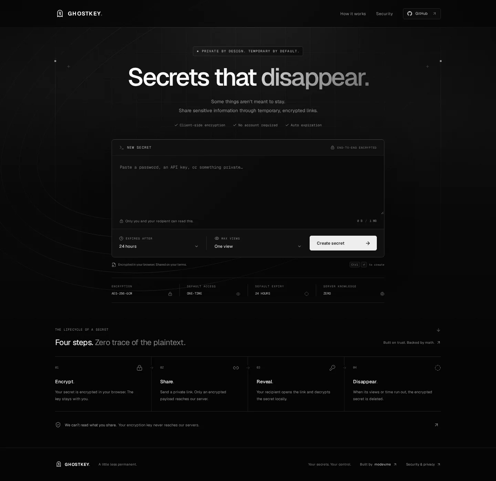

<p align="center">
  <a href="https://ghostykey.vercel.app">
    
  </a>
</p>

<p align="center">
  Share sensitive information through temporary, end-to-end encrypted links.<br />
  Encrypted in your browser. No account required. Gone on your terms.
</p>

<p align="center">
  <a href="https://ghostykey.vercel.app"><strong>Open GhostKey ↗</strong></a>
  &nbsp; · &nbsp;
  <a href="https://ghostykey.vercel.app/security">Security model</a>
  &nbsp; · &nbsp;
  <a href="#get-started">Run locally</a>
  &nbsp; · &nbsp;
  <a href="#deploy-to-vercel">Deploy your own</a>
</p>

<p align="center">
  <a href="https://nextjs.org"></a>
  <a href="https://www.typescriptlang.org"></a>
  <a href="https://supabase.com"></a>
  <a href="#security-boundaries"></a>
</p>

<p align="center">
  <a href="https://ghostykey.vercel.app">
    
  </a>
</p>

## A little less permanent

GhostKey turns a password, recovery code, private note, or other text into a disposable link. The browser encrypts it before anything leaves your device. The recipient gets an explicit reveal step, decrypts locally, and can clear the result from the screen.

| Built in | How it works |
| --- | --- |
| **Browser encryption** | AES-256-GCM with a fresh random key and IV for every secret. |
| **Keys stay with the link** | The key lives after `#` in the URL and is never sent to the server. |
| **Access on your terms** | One, five, ten, or unlimited views until expiration. One view by default. |
| **Automatic expiration** | Five minutes, one hour, 24 hours, seven days, or a custom duration. |
| **Atomic consumption** | PostgreSQL row locks prevent two requests from claiming the same final view. |
| **Creator controls** | Revoke a link from its creation screen with a separate deletion token. |
| **Minimal footprint** | No accounts, tracking scripts, or persistent browser storage for secrets. |

Built with **Next.js 16**, **React 19**, **TypeScript**, **Tailwind CSS 4**, **Supabase**, and **Zod**. Route Handlers provide the API; PostgreSQL owns the secret lifecycle. Deploy the application directly to Vercel.

[Architecture](#how-the-secret-travels) · [API reference](#api) · [Security boundaries](#security-boundaries) · [Verification](#verification)

## Get started

Use **Node.js 22 LTS (22.18+)** or **Node.js 24** and npm.

```bash
git clone https://github.com/Mo7ammedd/GhostyKey.git
cd GhostyKey
npm ci
cp .env.example .env.local
```

Set the following three variables in `.env.local`:

```dotenv
NEXT_PUBLIC_SUPABASE_URL=https://your-project.supabase.co
NEXT_PUBLIC_SUPABASE_PUBLISHABLE_KEY=your-publishable-key
SUPABASE_SERVICE_ROLE_KEY=your-server-only-key
```

Find keys under **Supabase → Project Settings → API Keys**. Use a new publishable key (`sb_publishable_...`), or set `NEXT_PUBLIC_SUPABASE_ANON_KEY` instead for a legacy anon key. For `SUPABASE_SERVICE_ROLE_KEY`, use a legacy **service_role** key or a new **secret** key (`sb_secret_...`). The server key must never have a `NEXT_PUBLIC_` prefix. The public key cannot substitute for it.

The public key is supported for Supabase project configuration; all secret database operations use the server-only client and restricted RPCs. No Supabase client or credentials are passed to the browser. Environment values are read lazily, so building and viewing the interface do not require database credentials. Without valid credentials and migrations, the API returns a safe `503 SERVICE_UNAVAILABLE`; there is no in-memory production fallback.

### Prepare Supabase

Apply these files **in order** using the Supabase SQL Editor:

1. `supabase/migrations/20260917000100_secret_storage.sql`
2. `supabase/migrations/20260917000200_secret_functions.sql`
3. `supabase/migrations/20260917000300_schedule_cleanup.sql`

For one SQL Editor paste, run `npm run db:setup:sql` and open the generated `supabase/setup.sql`. It contains the same migrations in a transaction and refreshes the PostgREST schema cache. This generated file is ignored by Git; the migration files remain the source of truth. Run first-time setup only once.

Alternatively, with the Supabase CLI installed, run `supabase init`, `supabase link --project-ref YOUR_PROJECT_REF`, then `supabase db push`. Use a fresh project or review migrations against your existing schema first.

The final migration installs/enables Supabase's `pg_cron` extension and schedules cleanup every five minutes. Verify it in **Supabase → Integrations → Cron**, or run:

```sql
select jobname, schedule, active
from cron.job
where jobname = 'ghostkey-expiration';
```

It should show `*/5 * * * *` and `active = true`. If `pg_cron` is unavailable, the migration raises a notice: enable the extension and rerun the scheduling migration before production. Expiration checks still reject expired secrets immediately, independently of cron.

Start the app:

```bash
npm run dev
```

Open `http://localhost:3000`. Localhost supports Web Crypto; other deployments require HTTPS. Restart the development server after changing environment variables if it does not reload them automatically.

## Deploy to Vercel

1. Apply the Supabase migrations and verify the cleanup job as above.
2. Push this directory to your Git provider and import the repository in Vercel.
3. Select the **Next.js** preset, Node **22.x**, and the repository root. Keep the default install command, `npm run build`, and default Next.js output settings.
4. Add the same three environment variables to the desired Vercel environments. Store `SUPABASE_SERVICE_ROLE_KEY` as a sensitive server-side environment variable.
5. Deploy. Shared links use the browser's current origin, so preview and custom domains work without an app URL variable.
6. Create a synthetic secret, open the complete link in a separate browser session, confirm reveal, and verify that reopening it reports consumption. Verify the cron job's run history in Supabase.

No Docker, separate backend, Vercel cron endpoint, custom build output, or additional production environment variables are required. Fonts are bundled locally through Geist; no external font requests are made.

The GitHub navigation links to this project's repository. Update its `href` in `src/components/site-header.tsx` if you fork the application.

## How the secret travels

```text
Sender's browser
  ├─ generates a fresh AES-256-GCM key and 96-bit IV
  ├─ encrypts the UTF-8 secret with a 128-bit authentication tag
  └─ POSTs ciphertext, IV, expiration and view limit
          ↓
Next.js Route Handler → restricted Supabase RPC → PostgreSQL
          ↓
Returns a random public ID and a separate deletion token
          ↓
Browser constructs /s/<id>#<encryption-key>
          ↓
Recipient checks metadata, explicitly confirms reveal,
then decrypts the returned ciphertext in their browser
```

Encryption keys and IVs come from the Web Crypto API. Public IDs and deletion tokens each use 32 random bytes. Only SHA-256 hashes of these server-generated tokens are stored in PostgreSQL. The key is unpadded base64url in the URL fragment; fragments are never included in HTTP requests. The shared link does not contain the deletion token.

Plaintext, keys, and deletion tokens are never written to local storage, session storage, IndexedDB, cookies, analytics, or application logs. Creation clears the editor after success. Revealed plaintext stays only in page memory, is cleared on `pagehide` or explicit clearing, and is automatically cleared after five minutes or at expiration, whichever comes first. After retrieval, the fragment is removed from the address bar. JavaScript cannot guarantee physical erasure of immutable strings or browser-managed memory.

### Atomic consumption

`consume_secret` executes in one PostgreSQL transaction:

1. Acquire a row lock using `SELECT … FOR UPDATE`.
2. Check the wall clock **after acquiring the lock**, so a request waiting across expiration cannot receive the secret.
3. Check the view limit.
4. Increment the view count, or delete the row when this is the last allowed view.
5. Return only the encrypted payload and access metadata.

Concurrent callers cannot spend the same final view. The last retrieval deletes the active ciphertext before committing. A hash-only status receipt distinguishes `SECRET_CONSUMED` from `SECRET_EXPIRED` for up to 24 hours; afterward the link returns `SECRET_NOT_FOUND`. Cleanup removes expired ciphertext, receipts, and rate buckets.

**A view means encrypted-payload retrieval**, not verified human reading. A lost response or a well-formed but incorrect key can spend a view. Decryption cannot be verified by a server that never receives the key. Neither the browser nor the Supabase client automatically retries consumption.

### Access and limits

| Setting | Behavior |
| --- | --- |
| Default | 24 hours, one view |
| Expiration presets | 5 minutes, 1 hour, 24 hours, 7 days |
| Custom expiration | 1 minute to 30 days, in whole minutes in the UI |
| UI view options | 1, 5, 10, or unlimited until expiration |
| API view range | Integers 0–100; `0` means unlimited |
| Plaintext limit | 1 MiB of UTF-8 bytes, including multibyte characters |
| Ciphertext limit | 1 MiB plus the 16-byte GCM authentication tag |
| Request limit | Bounded while streaming, even without an accurate Content-Length |
| Creation rate | 30 per trusted-client hourly bucket and 1,000 globally per hour |

On Vercel, rate limiting uses the edge-provided `x-vercel-forwarded-for` header. Only a one-way HMAC incorporating the UTC hour is stored; the raw IP is not stored by the application. Buckets expire after one hour. Outside Vercel, clients share a conservative fallback bucket; arbitrary forwarding headers are never trusted. Database rate counters are atomic and work across serverless instances.

## API

All responses use `Cache-Control: private, no-store` and disable CDN caching. Cross-origin browser requests are rejected. There are no authentication accounts in V1.

### `POST /api/secrets`

Content type: `application/json`. Encrypt locally before calling this endpoint.

```json
{
  "ciphertext": "<unpadded-base64url-ciphertext-and-tag>",
  "iv": "<unpadded-base64url-12-byte-IV>",
  "expiresIn": 86400,
  "maxViews": 1
}
```

Unknown fields, including plaintext or key fields, are rejected. Omitting the two settings applies the defaults. Success is `201`:

```json
{
  "id": "<43-character-random-id>",
  "deletionToken": "<separate-43-character-deletion-capability>",
  "expiresAt": "2026-09-18T12:00:00.000Z",
  "maxViews": 1
}
```

The creation page retains the deletion token only in memory. Closing it or creating another secret removes that page's deletion control; the secret still expires normally. API clients can securely retain the returned token if they need later revocation.

### `HEAD /api/secrets/[id]`

Checks availability **without consuming a view** and never returns ciphertext. A successful response includes:

```text
X-Secret-State: AVAILABLE
X-Secret-Expires-At: <ISO timestamp>
X-Secret-Max-Views: 1
X-Secret-View-Count: 0
X-Secret-Remaining-Views: 1
```

The remaining-views header is `unlimited` for unlimited secrets. Errors carry their code in `X-Secret-State` and an appropriate status, with no body.

### `GET /api/secrets/[id]`

Consumes one view. Requires `X-GhostKey-Reveal: 1`; ordinary GETs, crawlers, previews, and prefetches cannot accidentally consume the secret. The UI sends this only after explicit confirmation. This header prevents accidental consumption, not access by someone who already possesses the ID.

Success is `200` with `ciphertext`, `iv`, `expiresAt`, `maxViews`, `viewCount`, `remainingViews` (`null` for unlimited), and `consumed`. Use the key from the fragment to decrypt locally. Do not retry automatically.

### `DELETE /api/secrets/[id]`

Requires `Authorization: Bearer <deletionToken>`. Success is `204`. An absent, invalid, or incorrect token returns `403`; a link recipient's encryption key is never a deletion credential. Revocation removes ciphertext immediately and invalidates future reveals.

### Errors

```json
{
  "error": {
    "code": "SECRET_EXPIRED",
    "message": "This secret has expired and its encrypted contents have been deleted."
  }
}
```

| HTTP | Codes |
| --- | --- |
| 400 | `INVALID_SECRET_ID`, `INVALID_REQUEST` |
| 403 | `FORBIDDEN` |
| 404 | `SECRET_NOT_FOUND` |
| 410 | `SECRET_EXPIRED`, `SECRET_CONSUMED` |
| 413 | `PAYLOAD_TOO_LARGE` |
| 429 | `RATE_LIMITED`, with `Retry-After` |
| 500 | `INTERNAL_ERROR` |
| 503 | `SERVICE_UNAVAILABLE` |

Raw database errors, validation input, exception details, ciphertext, credentials, and request headers are never logged or reflected by these handlers.

## Security boundaries

- Every application table has RLS enabled and no public policies. `anon` and `authenticated` cannot read tables or execute secret functions. The service role can execute the approved RPCs; direct table grants and internal-helper execution are revoked.
- Database functions use `SECURITY DEFINER` with an empty `search_path` and schema-qualified table names. Run migrations as the project's trusted database owner.
- A fresh per-request CSP nonce protects Next.js scripts. Production CSP includes neither `unsafe-eval` nor `unsafe-inline`. Next.js's development debugger needs relaxed development-only directives. Dynamic rendering is intentional: cached HTML must not reuse a CSP nonce.
- Additional headers include `X-Content-Type-Options`, `X-Frame-Options`, `Referrer-Policy: no-referrer`, `Permissions-Policy`, HSTS, and same-origin opener isolation. Secret routes also send `X-Robots-Tag: noindex, nofollow, noarchive`.
- The browser makes no database requests. Its CSP permits only same-origin network requests. There are no external scripts, analytics, remote fonts, or image trackers.

Anyone with a complete shared link can read it subject to its access rules. Recipients can copy, save, or screenshot a secret. Copied text remains in the system clipboard. Browser history synchronization, extensions, compromised devices, and screenshots are outside the application’s control.

Client-side encryption protects database contents; it still depends on honest JavaScript delivered by the application host. A compromised host could change that JavaScript. Ciphertext length and access metadata remain observable. Active database deletion does not erase earlier infrastructure backups; manage Supabase backup retention according to your needs. Hosting providers may retain standard request metadata. The `/security` page explains these limits to users.

## Verification

```bash
npm run check      # ESLint, strict TypeScript, crypto and API unit tests
npm run build      # Optimized production Next.js build
npm run test:db    # Real PostgreSQL concurrency, lifecycle and authorization tests
npm run test:e2e   # Production browser flow against real PostgreSQL
```

Database and browser tests require a local PostgreSQL installation with `initdb` and `pg_ctl` on PATH, run as a non-root user. Install the browser once with `npx playwright install chromium` (on a fresh Linux machine, use `npx playwright install --with-deps chromium`).

The test wrapper creates a disposable cluster on a random loopback port, applies the actual migrations, and destroys the cluster after the run. It never reads production database credentials. Browser tests use a **test-only PostgREST-compatible HTTP bridge** to exercise the real Supabase SDK, Next.js API handlers, SQL functions, browser encryption, and strict production CSP. The bridge lives under `tests/`, is not included in application routes, and is never a production backend. Build before running browser tests. The browser suite reserves local ports `3105` and `54329`.

Tests cover:

- Encryption round trips, Unicode, byte limits, authentication-tag tampering, and incorrect keys.
- No plaintext or encryption key in outgoing API fields, headers, or request URLs.
- Non-consuming metadata/preview requests and explicit reveal confirmation.
- One-time, five-view, ten-view, unlimited, expired, and manually revoked secrets.
- Many concurrent consumers and an expiration that occurs while a row lock is held.
- RLS, function grants, protected deletion, atomic rate limits, and expiration cleanup.
- Complete create/copy/reveal/clear flows, inert HTML content, CSP, and mobile overflow checks.

A hosted Supabase project and Vercel deployment must still have their real environment variables, migrations, and cron job configured. The local test bridge verifies application behavior, not the availability or configuration of a particular hosted project.

## Project layout

```text
src/
  app/                  Pages, API Route Handlers, metadata and global styles
    api/secrets/        Creation, metadata, consumption and deletion
    s/[id]/             Client-side secret viewer
    security/           User-facing security and privacy explanation
  components/           Composer, result, viewer, navigation and UI primitives
  lib/
    crypto/             Browser-only AES-GCM and base64url encoding
    hooks/              In-memory viewer lifecycle, clipboard and countdown
    secrets/            API transport, server operations, limits and safe errors
    security/           CSP construction
    supabase/           Lazy, server-only service-role client
    validation/         Shared Zod schemas
  types/                RPC and application types
  proxy.ts              Per-request CSP nonce and cache policy
supabase/migrations/    Tables, atomic functions and scheduled cleanup
tests/                  Unit, PostgreSQL and production browser tests
scripts/                Disposable test-database runner
```
